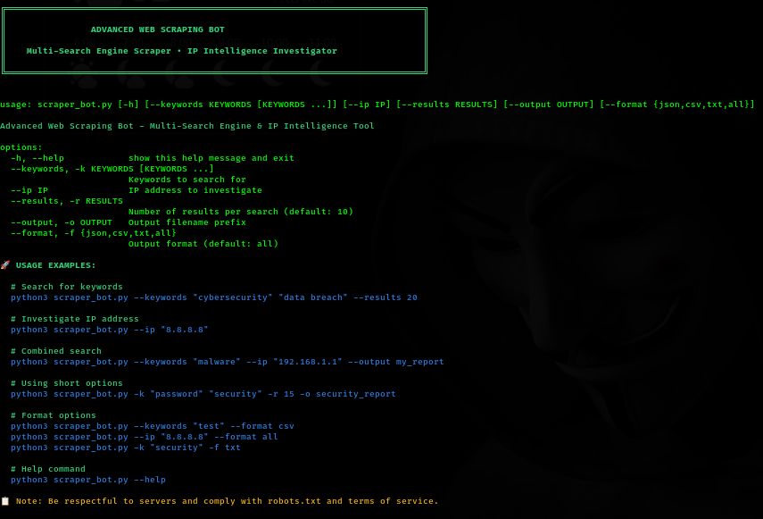

# 🕷️ WebScraper Bot

Advanced Web Scraping Bot - Multi-Search Engine & IP Intelligence Tool


## ✨ Features

- Multi-search engine scraping
- IP address intelligence gathering
- Customizable result limits
- Multiple output formats (JSON, CSV, TXT)
- Easy-to-use command-line interface

## 🔧 Prerequisites

- Python 3.6 or higher
- pip (Python package installer)
- Git

## 📦 Installation

1. **Clone the repository**
   ```bash
   git clone https://github.com/hackerjoe69/WebScraper_Bot.git
   ```

2. **Navigate to the project directory**
   ```bash
   cd WebScraper_Bot
   ```

3. **Create a virtual environment**
   ```bash
   python3 -m venv venv
   ```

4. **Activate the virtual environment**
   
   - **Linux/macOS:**
     ```bash
     source venv/bin/activate
     ```
   
   - **Windows:**
     ```bash
     source venv/scripts/activate
     ```

5. **Install dependencies**
   ```bash
   pip install -r requirements.txt
   ```

## 🚀 Usage

```
usage: scraper_bot.py [-h] [--keywords KEYWORDS [KEYWORDS ...]] [--ip IP] 
                      [--results RESULTS] [--output OUTPUT] [--format FORMAT]

Advanced Web Scraping Bot - Multi-Search Engine & IP Intelligence Tool

optional arguments:
  -h, --help            show this help message and exit
  --keywords KEYWORDS [KEYWORDS ...], -k KEYWORDS [KEYWORDS ...]
                        Keywords to search for
  --ip IP               IP address to investigate
  --results RESULTS, -r RESULTS
                        Number of results per search (default: 10)
  --output OUTPUT, -o OUTPUT
                        Output filename prefix
  --format FORMAT, -f FORMAT
                        Output format: json, csv, txt, or all
```

## 💡 Examples

### Search for keywords
```bash
python3 scraper_bot.py --keywords "cybersecurity" "data breach" --results 20
```

### Investigate IP address
```bash
python3 scraper_bot.py --ip "8.8.8.8"
```

### Combined search (keywords + IP)
```bash
python3 scraper_bot.py --keywords "malware" --ip "192.168.1.1" --output my_report
```

### Using short options
```bash
python3 scraper_bot.py -k "password" "security" -r 15 -o security_report
```

### Specify output format
```bash
# CSV format
python3 scraper_bot.py --keywords "test" --format csv

# All formats
python3 scraper_bot.py --ip "8.8.8.8" --format all

# TXT format using short option
python3 scraper_bot.py -k "security" -f txt
```

### Display help
```bash
python3 scraper_bot.py --help
```

## 📊 Output Formats

The tool supports multiple output formats:

- **JSON** - Structured data format
- **CSV** - Spreadsheet-compatible format
- **TXT** - Plain text format
- **ALL** - Generate all formats simultaneously

## ⚠️ Notes

- Be respectful to servers and comply with robots.txt and terms of service
- Some websites may block automated requests
- Use reasonable rate limits to avoid overwhelming target servers
- Ensure you have permission to scrape the target websites
- This tool is for educational and research purposes

## Screenshot


## 🤝 Contributing

Contributions, issues, and feature requests are welcome!

## 👤 Author

**hackerjoe69**

- GitHub: [@hackerjoe69](https://github.com/hackerjoe69)

---

⭐ If you find this project useful, please consider giving it a star!